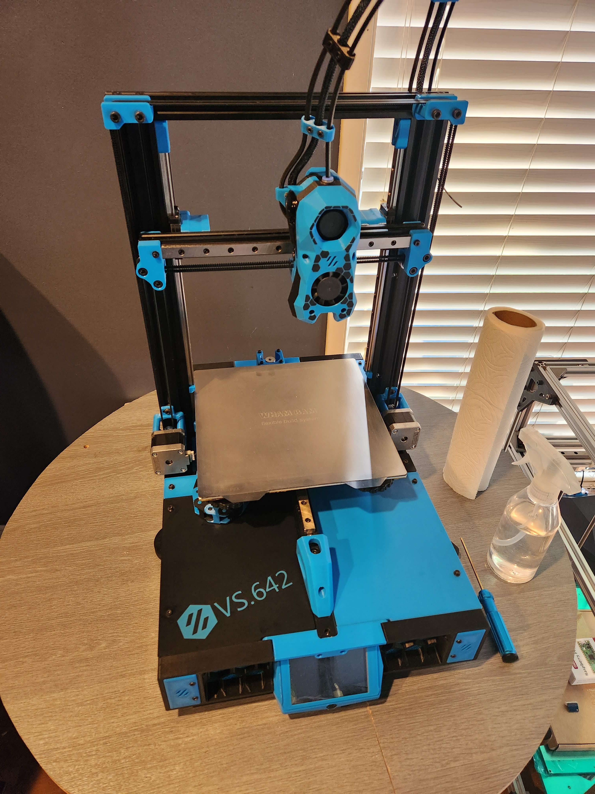

This is my Enderwire build based on the amazing work of DarkDog and Thomasfjen. I started building the EnderWire non-pro design and found a few components that I needed to make. The custom parts I have created for this this design are:

- Printable deck plates for the Ender 3 non-pro -> Enderwire conversion
- Manta E3EZ mounting plate
- MKS Mosfet mounting plate
- Frame cable clamps (2 cable)
- SB Toolhead cable clamp (2 cable)
- Umbilical clamps (3 cable)
- Bed ADXL perma mount
- PSU cover plate

All files are uploaded here for ease of access.

https://vorondb.com/printer/307

https://github.com/thomasfjen/enderwire_nonpro
https://github.com/boubounokefalos/Ender_SW/tree/Rev.2

